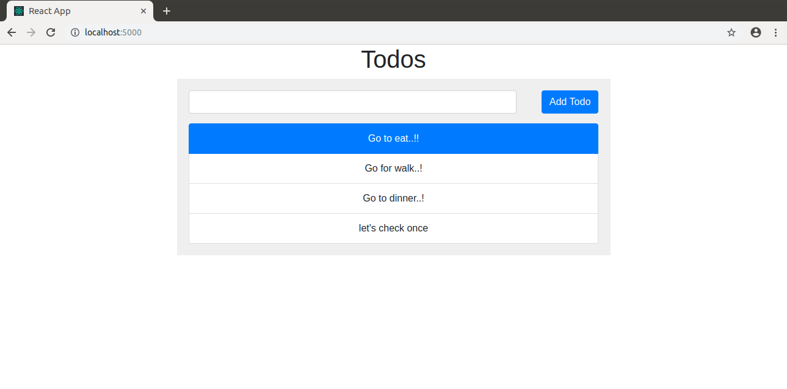

# ReactJS ExpressJS MongoDB project

## Requirement

- Docker >= 20.10
- Docker compose plugin

Preferred for convenience during development:

- NodeJS 16

If you don't have the dependencies above, you can still use the ones provided inside docker containers.

## Test URL
- FE: http://localhost:3000
- BE: http://localhost:3001/api
- MongoExpress: http://localhost:8081
- Swagger: http://localhost:3001/api-docs

## Setup development environment

Run project with the following command 

```sh
make devrun
```


```sh
make devrun
```

Getting inside FE container:

```sh
make devfe
```

Getting inside BE container:

```sh
make devbe
```

Stop all container with:

```sh
make devdown
```


Project structure:
```
.
├── backend
│   ├── Dockerfile
│   ...
├── compose.yaml
├── frontend
│   ├── ...
│   └── Dockerfile
└── README.md
```

[_compose.yaml_](compose.yaml)
```
services:
  frontend:
    build:
      context: frontend
    ...
    ports:
      - 3000:3000
    ...
  server:
    container_name: server
    restart: always
    build:
      context: server
      args:
        NODE_PORT: 3000
    ports:
      - 3000:3000
    ...
    depends_on:
      - mongo
  mongo:
    container_name: mongo
    restart: always
    ...
```
The compose file defines an application with three services `frontend`, `backend` and `db`.
When deploying the application, docker compose maps port 3000 of the frontend service container to port 3000 of the host as specified in the file.
Make sure port 3000 on the host is not already being in use.

## Deploy with docker compose

```
$ docker compose up -d
Creating network "react-express-mongodb_default" with the default driver
Building frontend
Step 1/9 : FROM node:13.13.0-stretch-slim
 ---> aa6432763c11
...
Successfully tagged react-express-mongodb_app:latest
WARNING: Image for service app was built because it did not already exist. To rebuild this image you must use `docker-compose build` or `docker-compose up --build`.
Creating frontend        ... done
Creating mongo           ... done
Creating app             ... done
```

## Expected result

Listing containers must show containers running and the port mapping as below:
```
$ docker ps
CONTAINER ID        IMAGE                               COMMAND                  CREATED             STATUS                  PORTS                      NAMES
06e606d69a0e        react-express-mongodb_server        "docker-entrypoint.s…"   23 minutes ago      Up 23 minutes           0.0.0.0:3000->3000/tcp     server
ff56585e1db4        react-express-mongodb_frontend      "docker-entrypoint.s…"   23 minutes ago      Up 23 minutes           0.0.0.0:3000->3000/tcp     frontend
a1f321f06490        mongo:4.2.0                         "docker-entrypoint.s…"   23 minutes ago      Up 23 minutes           0.0.0.0:27017->27017/tcp   mongo
```

After the application starts, navigate to `http://localhost:3000` in your web browser.



Stop and remove the containers
```
$ docker compose down
Stopping server   ... done
Stopping frontend ... done
Stopping mongo    ... done
Removing server   ... done
Removing frontend ... done
Removing mongo    ... done
```